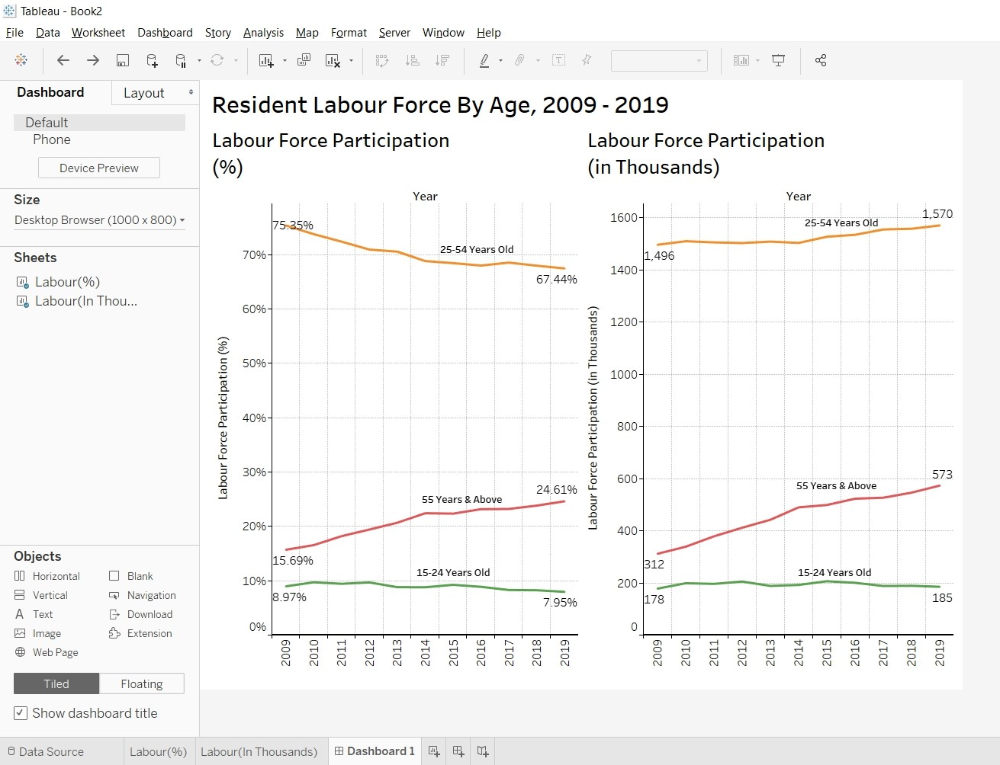

```{r setup, include=FALSE}
knitr::opts_chunk$set(echo = FALSE)
```


# Data Visualisation Critique

The original visualisation (as follows) is the Resident labour force by age (Chart 6) in MOM’s Report. 
{width=100%} <br> 


## Clarity

| **S/N**	| **CRITIQUES**                                                                                                            	| **SUGGESTIONS**                                              	|
|-----	|----------------------------------------------------------------------------------------------------------------------	|----------------------------------------------------------	|
| 1.   	| There is no Y axis in the visualisation. Therefore, the value of the line graph is not immediately obvious.                                                                                                                                                                                                                 	| To include Y axis and gridline to guide the eyes.           	|
| 2.   	| It is not intuitive to know which value on the X-axis represent the age and which is the labour force participating rate.                                                                                                                                                                                                   	| To include clear labels for the axis.                       	|
| 3.   	| The visualisation shows the median age for 2009 is 41 years and the median age for 2019 is 44 years. However, the line graph do not have any statistical information to derive the median age but reference lines were drawn to intercept with the line graph. Inferring that the line graph could generate the median age. 	| To remove median data from the visualisation.               	|
| 4.   	| The objective of the visualisation is to show there are more older residents in the labour force since 2009. The visualisation only show data for 2009 and 2019 and not the data between 2009 to 2019. The increasing trend is not apparent to the readers.                                                                 	| To include data points for the years between 2009 and 2019. 	|
| 5.   	| Clear graph title to tell readers the context.                                                                                                                                                                                                                                                                              	| To retain the use of title.                                 	|
| 6.   	| X-axis title could be better positioned and named to provide context.                                                                                                                                                                                                                                                     	| To re-position the X-axis title.                            	| 
| 7.    | Source where the information were from were highlighted to give assurance to reader on the accuracy of the data.    | To retain the source information on the visualisation.    |


## Aesthetics

| **S/N**	| **CRITIQUES**                                                                                                            	| **SUGGESTIONS**                                              	|
|-----	|----------------------------------------------------------------------------------------------------------------------	|----------------------------------------------------------	|
| 1.   	| Good use of colour to differentiate 2009 and 2019 values.                                                            	| To maintain the use of colour to differentiate values.   	|
| 2.   	| Good font and good font size to detailed out the information.                                                        	| To maintain the use of good font and good font size.     	|
| 3.   	| Units are not indicated at the X-axis tick values. Might be hard for readers to interpret what the values represent. 	| To provide unit details at the axis.                     	|
| 4.   	| The visualisation is not well-balanced as there are too much data value at the X-axis.                               	| To balance out the data values across the visualisation. 	|


# Proposed Design


- Provide the data value from 2009 to 2019 so that readers could see the trend.<br>
- Grouped the data value (line graph) into 15-24, 25-54 and 54 & above so that readers can clearly see the different categorisation as highlighted in the writeup.<br>
- Show the absolute values and the labour participation rate for each of the year, so that readers are able to better appreciate the context. <br>
- Include the labour participation rate and labour participation (in thousands) as the Y-axis so that readers could know reference the value of the line graph. <br>
- Provide labels to describe the axes.<br>
- Removed median data from the visualisation as the data values in the visualisation is not able to calculate the median.<br>


# Data Visualisation Steps


| S/N | STEPS                                                                         | ACTIONS                                                                                                                                                                                                                                                                                                                                                          |
|-----|-------------------------------------------------------------------------------|------------------------------------------------------------------------------------------------------------------------------------------------------------------------------------------------------------------------------------------------------------------------------------------------------------------------------------------------------------------|
| 1.   | Import excel file   (mrsd_2019LabourForce_T7.xlsx) into Tableau Prep Builder. | 1. Select T7_T from the Connection   Pane and Single Table in the Input Pane.<br> {width=100%} <br><br> 2. Add a "Clean Step"                                                                                                                                                                                                                                                         |
| 2.   | Commence Data Preparation                                                     | 1. Remove first 6 rows of the   data which are all title information.<br> {width=100%} <br><br> 2. Remove columns with NULL values. <br> {width=100%} <br><br>  3. Rename first column to Age and the rest of columns to the year starting from 2009 to 2019.<br> {width=100%} <br><br>   4. Select column 2009 to 2019, pivot the columns to rows.<br>  {width=100%} <br><br> 5. Rename Pivot 1 Name to Year and Pivot 1 Value to Population.<br>        |
| 3.   | Save the data                                                                 | Save the output as Output.hyper.{width=100%} <br><br>                                                                                                                                                                                                                                                                                                                                 |
| 4.   | Import the Output.hyper to Tableau                                            | 1. Import data into Tableau. <br>  2. Change the data type for Year from String to Date.<br>  3. Change the data type for Population from String to Number(Decimal).<br> {width=100%} <br> <br>                                                                                                                                                                                            |
| 5.   | Create Visualisation for Participation Rate                                                         | 1. Go to Sheet 1.<br>  2. Drag Year to Columns.<br>  3. Drag Population to Rows.<br>  4. Change the measures for Population to SUM.<br>{width=100%}<br> <br> 5. Change the Percentage of to Cell.<br>{width=100%}<br><br>                                                                                                                                                                                   |
| 6.   | Grouping of Age Group                                                         | 1. Select 15-19 and 20-24, right click and Grouped them.<br>  2. Select 25-29, 30-34, 35,39,40-44, 45-49 and 50-54 and Grouped them.<br>  3. Select 55-59,60-64, 65-69 and 70 & Over and Grouped them.<br>{width=100%}<br> <br>  4. Rename each of the Age Category and Title.<br>  5. Show the Hide Marker.<br>  6. Rename the Title and axis labels and provide Source information under Caption.<br> 7. Rename the sheet to "Labour(%)                            
                                                |
| 7.   | Create Visualisation for Population (In Thousands)                                                        | 1. Duplicate Sheet 1. <br> 2. Click on the row SUM(Population), click "Clear Table Calculation".<br> {width=100%}<br><br> 3. Rename the Y-axis title. 4. Rename the sheet to "Labour(In Thousands)                                                                                                                      |
| 8.   | Create Dashboard                                                         | 1. Add a new dashboard <br> 2. Drag Labour(%) to the left of the dashboard and Labour(In Thousands) to the right.<br> 3. Rename the Dashboard Title.<br> {width=100%}<br><br> 4. Export the dashboard as image.<br> <br>                         
                                                |


# Final Data Visualisation Output

{width=100%}


## Observation 1

Although the labour force participation rate shows the share of resident labour force aged 25-54 declined from 75% to 67%, the absolute number of people in the age band actually increases (from 1496 thousands in 2009 to 1570 thousands in 2019)


## Observation 2

Over the last 10 years, both the 25-54 and 15-24 age bands showed a downward trend for the participation rate while the 55 years and above showed a upward trend. Might be due to ageing population and low birth rate.

## Observation 3

Total number of people in the working population increases over the years (from 1986 thousands in 2009 to 2328 thousands in 2019).