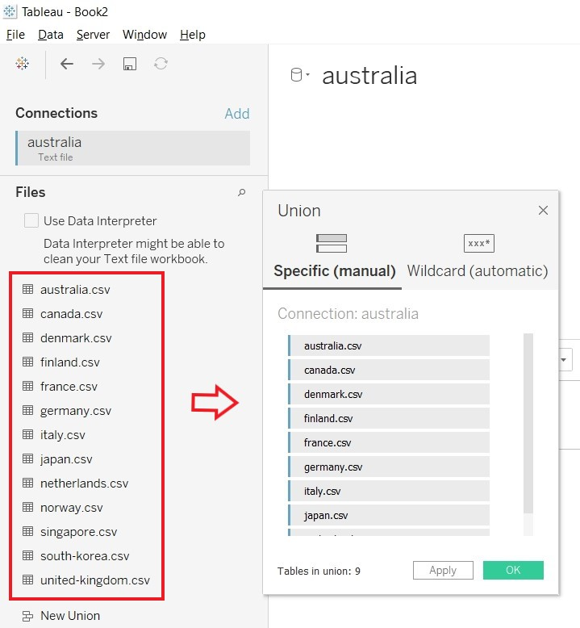
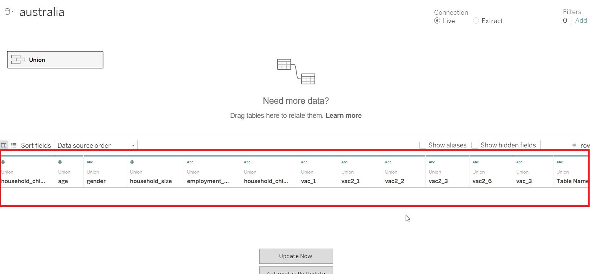
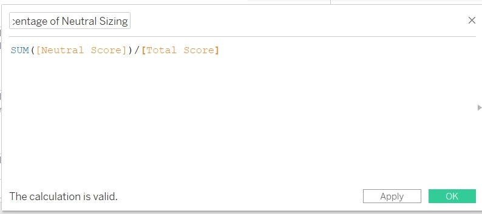
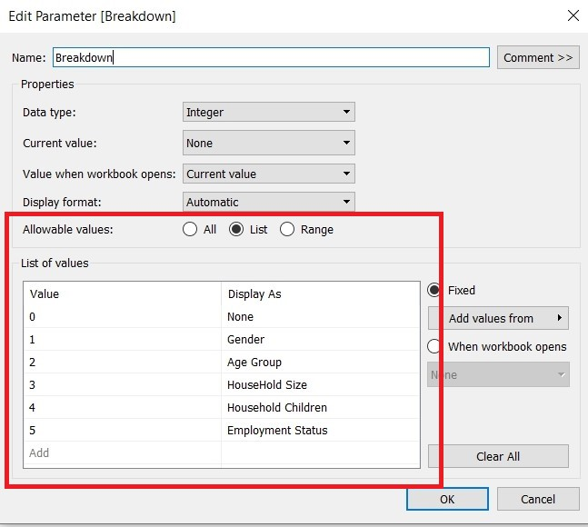
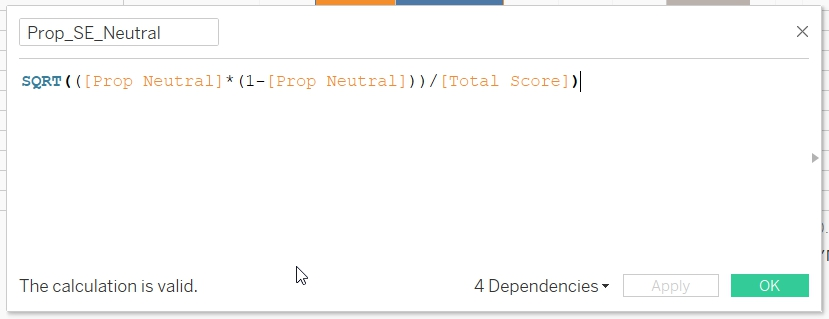
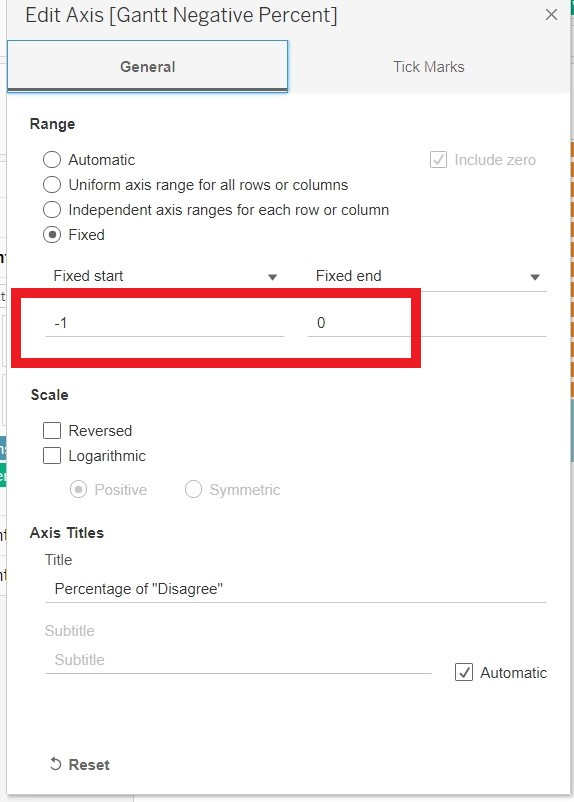
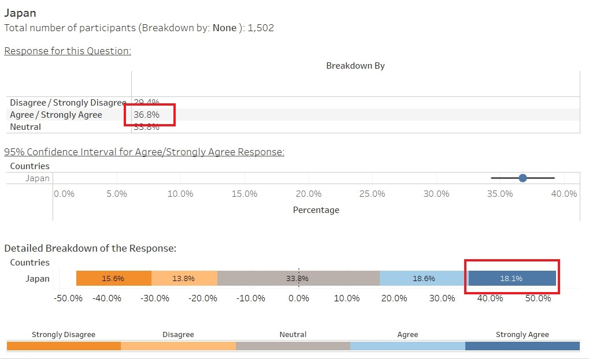

```{r setup, include=FALSE}
knitr::opts_chunk$set(echo = FALSE)
```

# Data Visualisation Critique

The original visualisation (as follows) shows the willingness of the public on Covid-19 vaccination. 
 <br> 

## Clarity

| **S/N**	| **CRITIQUES**                                                                                                            	| **SUGGESTIONS**                                              	|
|-----	|----------------------------------------------------------------------------------------------------------------------	|----------------------------------------------------------	|
| 1.   	| Unable to determine the total number of people that responded to the survey. The result might not be representative if only a small number of people were interviewed.| To include the number of people interviewed from each country.         	|
| 2.   	| The chart was derived from the survey question “If a Covid-19 vaccine were made available to me this week, I would definitely get it:”. This question does not imply that the individuals are pro-vaccine. There are other similar questions (e.g: "If I do not get a COVID19 vaccine when it is available, I will regret it") but the results were not used. The result might not be representative and will be misleading to the reader.  	| To change the title of the graph or include the question to provide clarity.           	|
| 3.   	| The "Legend" was titled as "Vac1". Unclear what "Vac1" means. Number 2 to 4 are not labelled to tell reader what it represent.                                                                	| To be clear on the information presented.	|
| 4.   	| Is hard to determine the value for each of the response (color bar).| To label the value for each color bar or re-position the bar.| 


## Aesthetics

| **S/N**	| **CRITIQUES**                                                                                                            	| **SUGGESTIONS**                                              	|
|-----	|----------------------------------------------------------------------------------------------------------------------	|----------------------------------------------------------	|
| 1.   	| All axes are clearly labeled.                             	| To continue to label all axes.   	|
| 2.   	| Good font and good font size to detailed out the information.                                                        	| To maintain the use of good font and good font size.     	|
| 3.   	| The choice of color for the bar is distracting and overwhelming. 	| To change the color scheme.                     	|
| 4.   	| The left chart was sorted based on country while the right chart was sorted based on percentage of “strongly agreed”. Is hard for reader to match the result for the two charts. Moreover, the information presented in the right chart could be found in the left as well. Is redundant to show the information again (Waste of space).    	| Do not repeat information presented.                       	|
| 5.   	| The gridline for the left chart is too soft / light. Making it hard for reader to use it to reference the values. 	| To darken the gridline.|
| 6.   	| The X-axis for the right chart stopped at 60%. However, the value for United Kingdom goes beyond 60%. There is a need to extend the tick mark for the X-axis 	| To extend the tick marks for x-axis.


# Proposed Design


The Advantages or issues that the alternative design tries to overcome are:

- Change the scale of the result from 5 (Strongly Agree, Agree, Neutral, Disagree and Strongly Disagree) to 3 (Agree/Strongly Agree, Neutral and Disagree/Strongly Disagree). Presenting the results in a simplified categories helps in making the chart easier to read. Since Strongly Agree and Agree as well as Strongly Disagree and Disagree, in this instance, do indicate inclination towards willingness or unwillingness.<br><br>
- Break the Disagree, Agree and Neutral into 3 charts so that readers can see the distribution clearly. <br><br>
- Show the questions so that readers better understand the context to the response. Include details such as when the surveys were taken, number of people involved so as to provide more clarity to readers.<br><br>
- Allow breakdown by Gender, Age etc so that readers can better appreciate the details. <br><br>
- To have tooltip to detail out more information for readers who are interested to find out more. <br><br>
- To include Confidence Interval to indicate the uncertainty of the outcome.


# Data Visualisation Steps

- <b> Preparing the Dataset<b><br><br> 1. Comparing the fields of the dataset, one can realises that Finland, Norway, Denmark and Sweden do not have the field "employment_status". Instead, the employment status was capture by various fields (employment_status_1, employment_status_2 etc.)<br><br> {width=100%} <br><br> 2. To align to the rest of the dataset, need to create the field "employment_status" and change the header to reflect the employment status ("Fulltime Employment","Not Working" etc)<br><br> {width=100%} <br><br> 3. Use the formula to update the value for "employment_status".<br><br> {width=100%} <br><br> 4. Save the file and repeat it for the rest of the countries (Norway, Denmark and Sweden). 5. For Sweden, there is a need to rename "record" to "RecordNo", to align to rest of the dataset. <br><br>  <br><br>

- <b>Import data into Tableau<b> <br><br> 1. Select "Text File" from Connect Panel.<br><br>{width=100%} <br><br> 2. Select australia.csv. <br><br> <br><br>  3. Remove australia.csv from the panel. <br><br> {width=100%} <br><br>  4. Click on "New Union" under the File Panel. <br><br>  <br><br> 5. Import all the countries into the "New Union" panel and click OK. <br><br>  <br><br>

- <b>Commence Data Preparation<b><br><br> 1. Hide all the parameters and retain only the following a) RecordNo b) endtime c) household_children d) household_size e) gender f) age g) employment_status h) vac-1 i) vac2_1 j) vac2_2 k) vac2_3 l) vac2_6 and m) vac3. n) Table Name <br><br> {width=100%} <br><br> 2. Convert the Connection to "Extract" <br><br>  <br><br>  3. As we are only interested in Jan 2021 data, click on "Edit" under FILTER to add a filter. <br><br> 4. Add a filter for "endtime" and set it to Jan 2021. <br><br>  <br><br>   5. Edit the range of date to Jan 2021, to use only Jan 2021 data.<br><br> <br><br> 6. Select (vac1, vac2_1, vac2_2, vac2_3, vac2_6 and vac3) and pivot the data, for ease of processing subsequently. <br><br>{width=100%} <br><br>   7. Rename the "Pivot Field Names" to "Question" and "Pivot Field Values" to "Answer" <br><br>  <br><br>  8. Change the aliases for Question to reflect the actual questions. <br><br>  <br><br><br><br>  <br><br>  9. As the "Answer" value consist of a mix of character and numeric data, need to remove all the characters information. Click on "Custom Split" at "Answer" <br><br>  <br><br> 10. Add in the separator "–" to "Answer"<br><br>  <br><br> 11. Add in separator "-" to Answer-Split1 <br><br> 12. Rename Answer-Split2 to "Answer_Cleaned" and change data type to "Number(Whole)" <br><br>  <br><br> 13. Change the data type for household_size to String. <br><br>  <br><br> 14. Change the aliases of "Table Name" to remove the .csv portion. <br><br>  <br><br>


- <b>Save the data <b><br><br> 1. Click on "Sheet 1" and save the data as "dataviz2.hyer" <br><br>  <br><br>   

- Prepare Fields for Visualisation <br><br>  1. To count the number of record for subsequent formula, Create Calculated Field "RecordNumber"<br><br>  <br><br> 2. To set record with Negative value to 1 by creating a Calculated Field "Negative Score".<br><br>  <br><br> 3. To set record with Positive value to 1 by creating a Calculated Field "Positive Score".<br><br>  <br><br>    4. To set record with Neutral value to 1 by creating a Create Calculated Field "Neutral Score".<br><br>  <br><br>     5. Count the number of Negative score by creating the Calculated Field "Total Negative Score".<br><br>  <br><br>   6.Count the number of Positive score by creating the Calculated Field "Total Positive Score".<br><br>  <br><br> 7. Count the number of Neutral score by creating the Calculated Field "Total Neutral Score".<br><br>  <br><br>    8. Count the total number of records by create the Calculated Field "Total Score".<br><br>  <br><br> 8. Count the size/percentage of the negative score by creating Calculated Field "Percentage of Negative Sizing".<br><br>  <br><br>    9. Count the size/percentage of the Positive score by creating Calculated Field"Percentage of Positive Sizing".<br><br>  <br><br>    10. Count the size/percentage of the Neutral score by creating Calculated Field Create Calculated Field "Percentage of Neutral Sizing".<br><br>  <br><br>    11. Change the "Number Format" to Percentage for "Percentage of Neutral Sizing", "Percentage of Positive Sizing" and " Percentage of Negative Sizing".<br><br>  <br><br>    12. Create Calculated Field "Gantt Positive Percent".<br><br>  <br><br>   13. Create Calculated Field "Gantt Neutral Percent".<br><br>  <br><br>   14. Create Calculated Field "Gantt Negative Start".<br><br>  <br><br>  15. Create Calculated Field "Gantt Negative Percent".<br><br>  <br><br>    16. Convert the response from 5 scale to 3 scale value (Agree/Strongly Agree, Disagree/Strongly Disagree) by duplicating "Answer_Cleaned" and edit the formula. Save the edited formula as Answer_Grp. <br><br>  <br><br>       17. Create Calculated Field "Negative Score_Gantt" <br><br>  <br><br>    18. Create Calculated Field "Total_Negative_Score_Gantt" <br><br>  <br><br>      19. Create Calculated Field "Gantt Start" <br><br>  <br><br>      20. Create Calculated Field "Gantt Percent" <br><br>  <br><br> 21. Age is currently a range of value. Need to bin the value into 3 different bin. Go to Age and create Group.<br><br>  <br><br>   22. Create the following Age Group. <br><br>  <br><br>  23. To provide reader with the option of breaking down the data into different categories, Create Parameter "Breakdown". <br><br>  <br><br>    24. Create Calculated Field "Breakdown By". <br><br>  <br><br> 25. Rename "Table Name" to "Countries" <br><br>

- Create a sheet to be included as part of Tooltip. This sheet will be used to detailed out the percentage for each of the rating. <br><br> 
1. Create a new sheet "DetailedStat". Drag "Answer_Grp" to Rows, "Measure Names" to Columns, "Gantt Percent" and "Percentage of Total Sizing" to Measure Values. <br><br>  {width=100%} <br><br> 
2. Drag the "Breakdown By" to the Columns to facilitate the use of Breakdown parameter.<br><br>  {width=100%} <br><br>

- Create a sheet to be included as part of Tooltip. This sheet will be used as Legend for the Likert Scale. <br><br> 
1. Drag "Answer_Cleaned" to Columns. "Answer_Cleaned" to Color and "CNTD(RecordNumber)" to Size. <br><br>   {width=100%}<br><br>  
2. Save the sheet as Legend. <br><br> 


- Create a sheet to show the result of the survey in Likert Scale. This sheet will be used as part of the Tooltip. <br><br>
1. Go to a new sheet. Drag "Gantt Percent" to Columns. "Countries" to Rows. "Answer_Cleaned" to Color and "Percentage of Total Sizing" to Size and Label. Change the "Compute Using" for "Gantt Percent" and "Percentage of Total Sizing" to "Answer_Cleaned". <br><br>  {width=100%} <br><br> 
2. Right click on the x-axis and select "Add Reference Line" to add Reference Line. <br><br> <br><br>  
3. At the popup, change the "Value" to 0 and Constant. Label to None, Tooltip to None and Line to ----- <br><br>  <br><br> 4. Save the sheet as "Gantt_Tooltip".<br><br> 


- Create a sheet that will calculate the 95% Confidence Interval of the survey result. This sheet would be added into the tooltip. <br><br> 
1. Create a new calculated field "Prop Positive". This is to count the probability of all Agree/Strongly Agree score.<br><br>  <br><br>   
2. Create a new calculated field "Prop Negative". This is to count the probability of all DisAgree/Strongly DisAgree score.<br><br><br><br>  <br><br>  
3. Create a new calculated field "Prop Neutral". This is to count the probability of Neutral score.<br><br> <br><br>  <br><br> 
4. Create a new calculated field "Prop_SE_Positive" <br><br>  <br><br> 
5. Create a new calculated field "Prop_ SE_Negative" <br><br>  <br><br> 
6. Create a new calculated field "Prop_SE_Neutral" <br><br>  <br><br> 
7. Create a new calculated field "Prop_Upper_Limit_95%_Positive", to calculate the upper limit of the Agree/Strongly Agree 95% Confidence Interval. <br><br>  <br><br> 
8. Create a new calculated field "Prop_Upper_Limit_95%_Negative", to calculate the upper limit of the DisAgree/Strongly DisAgree 95% Confidence Interval. <br><br>  <br><br> 
9. Create a new calculated field "Prop_Upper_Limit_95%_Neutral", to calculate the upper limit of the Neutral 95% Confidence Interval <br><br>  <br><br> 
10. Create a new calculated field "Prop_Lower_Limit_95%_Neutral" <br><br>  <br><br> 
11. Create a new calculated field "Prop_Lower_Limit_95%_Positive" <br><br>  <br><br> 
12. Create a new calculated field "Prop_Lower_Limit_95%_Negative" <br><br>  <br><br> 
13. Create a new calculated field "Z_95%" to store the value of the Z-score <br><br>  <br><br> 
14. Drag "Prop_Positive" to Columns and Countries to "Rows". Change it to Circle under the Mark card.  {width=100%}<br><br> 15. Drag Measure Values to centre of the screen <br><br>   {width=100%}<br><br> 
16. Exclude all the values and only retain "Prop_Lower_Limit_95%_Positive" and "Prop_Upper_Limit_95%_Positive"<br><br>  <br><br>
17. On the x-axis, click "Synchronize Axis"  <br><br>    <br><br> 
18. Under the "Measure Values" Mark card, Change it to Line  <br><br>    <br><br> 
19. Drag the "Measure Name" to Path. <br><br>    <br><br> 
20. Change the "Compute Using" for "Prop_Lower_Limit_95%_Positive", "Prop_Upper_Limit_95%_Positive" and "Prop Positive" to Cells. <br><br>    <br><br> 
21. Right click on the Value axis and uncheck the Show Header. <br><br>   {width=100%} <br><br> 
22. Right click on Prop Positive axis and choose format. Change the scale to Percentage. <br><br>   {width=100%} <br><br> 
23. Go to Measure Values Mark card, change the color. <br><br>   {width=100%}<br><br> 
24. Go to Prop Positive Mark card and change the size.  <br><br>   {width=100%} <br><br> 
25. Switch the Prop_Positive and Measure Values under Column. <br><br>   {width=100%}<br><br> 
26. Save the sheet as "Conf_Positive". <br><br> 
27. Repeat the process in creating Conf_Positive for "Conf_Negative" and "Conf_Neutral". This time choosing Prop_Lower_Limit_95%_Negative and Prop_Upper_Limit_95%_Negative for "Conf_Negative" and Prop_Lower_Limit_95%_Neutral and Prop_Upper_Limit_95%_Neutral for "Conf_Neutral"<br><br> 


- Create Visualisation in sheets<br><br> 1. Create a new sheets and name it "Main". Drag "Gantt Negative Percent" to Columns, "Table Name" to Rows, "Answer_Grp to Color and "Percentage of Negative Sizing" to Size. <br><br>  2. Change the Compute Using for "Gantt Negative Percent" and "Percentage of Negative Sizing" to "Answer_Grp".<br><br> {width=100%} <br><br>  3. Drag "Gantt Positive Percent" to Columns,"Answer_Grp" to Color and "Percentage of Positive Sizing" to Size. <br><br>  4. Change the Compute Using for "Gantt Positive Percent" and "Percentage of Positive Sizing" to "Answer_Grp".<br><br> {width=100%} <br><br>  5. Drag "Gantt Neutral Percent" to Columns,"Answer_Grp" to Color and "Percentage of Neutral Sizing" to Size. <br><br>  6. Change the Compute Using for "Gantt Neutral Percent" and "Percentage of Neutral Sizing" to "Answer_Grp".<br><br> {width=100%} <br><br>    
7. Change the title of the x-axis. <br><br>  <br><br>     
8. Change the scale of x-axis to Percentage and change the range. <br><br>  <br><br>{width=100%} <br><br>     
10. Add "Breakdown By" to Rows of "Main". Under Parameter, Click on "Show Parameter" for "Breakdown". <br><br> 
11. Add "Question" to Filter and click OK. <br><br>    <br><br> 
12. Allow the "Question" filter to apply to other sheets ("Grantt_Tooltip","DetailedStat","Prop_Positive", "Prop_Negative" and "Prop_Neutral") by right clicking on the Question Filter. <br><br>   <br><br>  <br><br>   
13. Go to Customise and uncheck "Show All Value". This will remove the (All) value <br><br>    <br><br>  <br><br>      
14. On the "Gantt Negative Percent" card, click on tooltip and edit the tooltip.    <br><br>   {width=100%} <br><br>  
15. Sheets can be added to the tooltip by clicking on the "Insert"    <br><br>    <br><br> 
16. Change to tooltip with the code as displayed.  <br><br>    <br><br> 
17. Repeat the process for "Gantt Positive Percent" card. Only different is to insert "Conf_Positive" sheet to the 95% Confidence Interval portion.  <br><br> {width=100%}<br><br> 
18. Repeat the process for "Gantt Neutral Percent" card. Only different is to insert "Conf_Neutral" sheet to the 95% Confidence Interval portion. <br><br> {width=100%}<br><br>
19. Change the title for Main by right clicking on the title and choose Edit Title. <br><br>  <br><br> 
20. Change the title as follows: <br><br>  <br><br>

- Create Dashboard<br><br>  1. Drag "Main" into Dashboard and name it "FinalDisplay". <br><br>  {width=100%} <br><br>                        
                                  


# Final Data Visualisation Output

{width=100%}<br><br>{width=100%} <br><br>  

## Observation 1

Based on the data visualisation for the question: "If a Covid-19 vaccine were made available to me this week, i would definitely get it.", Singapore have the lowest Percentage of Agree/Strongly Agree (34.5%). However, if only look at Strongly Agree, Japan has the lowest percentage (18.1%). There is a need to determine how to interpret the data for agree and strongly agree (similarly, for disagree and strongly disagree) as it will affect the overall interpretation of the data.
<br><br>{width=100%} <br> 
<br><br>{width=100%} <br><br>  


## Observation 2

For all the vaccine-related questions (except "I am worried about getting Covid19" and "I am worried about the potential side effects of a Covid19 vaccine"), the elderly (> 55 years old) are more receptive. Across the 14 countries listed, except South-Korea, participants above 55 years old have the highest percentage of Agree/Strongly Agree, Lowest Percentage of Disagree/Strongly Disagree and Lowest Percentage of Neutral. Figure shows result for one of the questions.<br><br>

{width=100%} <br><br>  


## Observation 3

For all the vaccine-related questions (except "I am worried about getting Covid19" and "I am worried about the potential side effects of a Covid19 vaccine"), participants from United-Kingdom and Denmark constantly had the highest percentage of Agree/Strongly Agree and lowest percentage of Disagree/Strongly Disagree across the different questions related to Covid-19 vaccine. The two countries also had the narrowest interval between the upper and lower limit, indicating that the result are precised. Figure shows result for one of the questions.<br><br>

{width=100%}<br>  
{width=100%} <br><br>  

