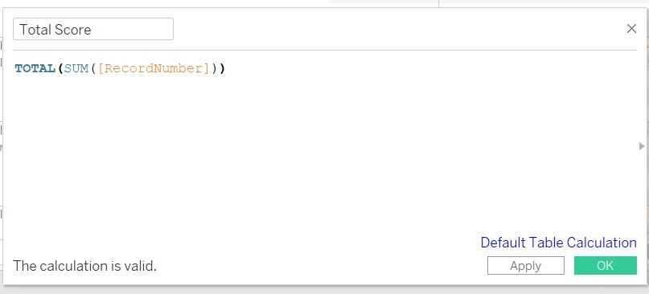
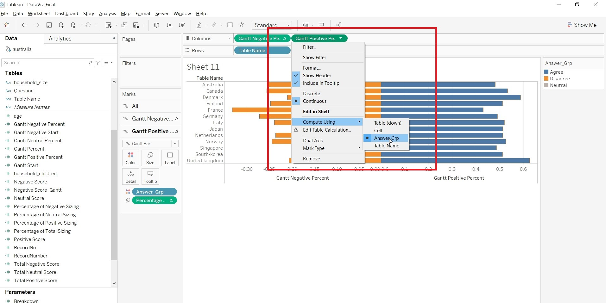
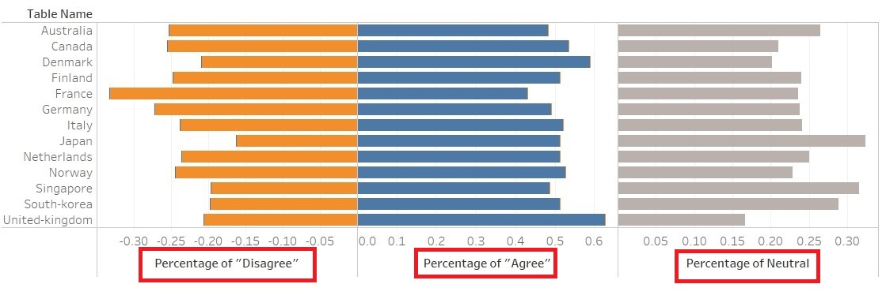

```{r setup, include=FALSE}
knitr::opts_chunk$set(echo = FALSE)
```

# Data Visualisation Critique

The original visualisation (as follows) shows the willingness of the public on Covid-19 vaccination. 
{width=100%} <br> 
## Clarity

| **S/N**	| **CRITIQUES**                                                                                                            	| **SUGGESTIONS**                                              	|
|-----	|----------------------------------------------------------------------------------------------------------------------	|----------------------------------------------------------	|
| 1.   	| Unable to determine the total number of people that responded to the survey. The result might not be representative if only a small number of people were interviewed.                                                                                                                                                                                                               	| To include the number of people interviewed from each country.         	|
| 2.   	| The left chart was sorted based on country while the right chart was sorted based on percentage of “strongly agreed”. Is hard for reader to match the result for the two charts. Moreover, the information presented in the right chart could be found in the left as well. Is redundant to show the information again.                                                                                                                                                                                                   	| Do not repeat information presented.                       	|
| 3.   	| The chart was derived from the survey question “If a Covid-19 vaccine were made available to me this week, I would definitely get it:”. This question does not imply that the individuals are pro-vaccine. There are other questions that could be interpreted as pro-vaccine as well. E.g “If I do not get a COVID19 vaccine when it is available, I will regret it”  	| To change the title of the graph            	|
| 4.   	| The "Legend" was titled as "Vac1". Unclear what "Vac1" means.                                                                 	| To be clear on the information presented.	|
| 5.   	| Is hard to determine the value for each of the rating (color bar).                                                                                                                                                                                                                                                    	| To label the value for each color bar.                           	| 


## Aesthetics

| **S/N**	| **CRITIQUES**                                                                                                            	| **SUGGESTIONS**                                              	|
|-----	|----------------------------------------------------------------------------------------------------------------------	|----------------------------------------------------------	|
| 1.   	| All axes are clearly labeled.                             	| To continue to label all axes.   	|
| 2.   	| Good font and good font size to detailed out the information.                                                        	| To maintain the use of good font and good font size.     	|
| 3.   	| The choice of color for the bar is overwhelming and a bit distracting. 	| To change the color scheme.                     	|


# Proposed Design


- Change the scale of the result from 5 (Strongly Agree, Agree, Neutral, Disagree and Strongly Disagree) to 3 (Agree/Strongly Agree, Neutral and Disagree/Strongly Disagree) to facilitate reading. Since Strongly Agree and Agree as well as Strongly Disagree and Disagree do mean the same things here. <br><br>
- Break the Disagree, Agree and Neutral into 3 charts so that readers can see the distribution clearly. <br><br>
- Show the question so that readers better understand the context to the response. <br><br>
- Allow breakdown by Gender, Age etc so that readers can better appreciate the details. <br><br>
- To have tooltip to detail out more information for readers who are interested to find out more details. <br><br>


# Data Visualisation Steps


| S/N | STEPS                                                                         | ACTIONS                                                                                                                                                                                                                                                                                                                                                          |
|-----|-------------------------------------------------------------------------------|------------------------------------------------------------------------------------------------------------------------------------------------------------------------------------------------------------------------------------------------------------------------------------------------------------------------------------------------------------------|
| 1.   | Import data into Tableau | 1. Select "Text File" from Connect Panel.<br><br>{width=100%} <br><br> 2. Select australia.csv. <br><br>  3. Remove australia.csv from the panel. <br><br> {width=100%} <br><br>  4. Click on "New Union" under the File Panel. <br><br>  5. Import all the countries into the "New Union" panel. <br><br> {width=100%} <br><br>                                                                                                                                                                                                                                                        |
| 2.   | Commence Data Preparation                                                     | 1. Hide all the parameters and retaining the following a) RecordNo b) endtime c) household_children d) household_size e) gender f) age g) employment_status h) vac-1 i) vac2_1 j) vac2_2 k) vac2_3 l) vac2_6 and m) vac3. n) Table Name <br><br> {width=100%} <br><br> 2. Convert the Connection to "Extract" <br><br> {width=100%} <br><br>  3. Click on "Edit" under FILTER to add a filter. <br><br> 4. Add a filter for "endtime". <br><br> {width=100%} <br><br>   5. Edit the range of date to Jan 2021.<br><br>  {width=100%} <br><br> 6. Select (vac1, vac2_1, vac2_2, vac2_3, vac2_6 and vac3) and pivot the data <br><br>    {width=100%} <br><br>   7. Rename the "Pivot Field Names" to "Question" and "Pivot Field Values" to "Answer" <br><br> {width=100%} <br><br>  8. Change the aliases for Question to reflect the actual questions. <br><br> {width=100%} <br><br>  9. Click on "Custom Split" at "Answer" <br><br> {width=100%} <br><br> 10. Add in the separator "–" to "Answer"<br><br> {width=100%} <br><br> 11. Add in separator "-" to Answer-Split1 <br><br> 12. Rename Answer-Split2 to "Answer_Cleaned" and change data type to "Number(Whole)" <br><br> {width=100%} <br><br> 13. Change the aliases of "Table Name". <br><br> {width=100%} <br><br>   |
| 3.   | Save the data                                                                 | 1. Click on "Sheet 1" and save the data as "dataviz2.hyer" <br><br> {width=100%} <br><br>                                                                                                                                                                             |
| 4.   | Prepare Fields for Visualisation                                          | 1. Create Calculated Field "RecordNumber" <br><br> {width=100%} <br><br> 2. Create Calculated Field "Negative Score".<br><br> {width=100%} <br><br> 3. Create Calculated Field "Positive Score".<br><br> {width=100%} <br><br>    4. Create Calculated Field "Neutral Score".<br><br> {width=100%} <br><br>     5. Create Calculated Field "Total Negative Score".<br><br> {width=100%} <br><br>   6. Create Calculated Field "Total Positive Score".<br><br> {width=100%} <br><br> 7. Create Calculated Field "Total Neutral Score".<br><br> {width=100%} <br><br>    8. Create Calculated Field "Total Score".<br><br> {width=100%} <br><br> 8. Create Calculated Field "Percentage of Negative Sizing".<br><br> {width=100%} <br><br>    9. Create Calculated Field "Percentage of Positive Sizing".<br><br> {width=100%} <br><br>    10. Create Calculated Field "Percentage of Neutral Sizing".<br><br> {width=100%} <br><br>    11. Change the "Number Format" to Percentage for "Percentage of Neutral Sizing", "Percentage of Positive Sizing" and " Percentage of Negative Sizing".<br><br> {width=100%} <br><br>    12. Create Calculated Field "Gantt Positive Percent".<br><br> {width=100%} <br><br>   13. Create Calculated Field "Gantt Neutral Percent".<br><br> {width=100%} <br><br>   13. Create Calculated Field "Gantt Negative Start".<br><br> {width=100%} <br><br>          14. Create Calculated Field "Gantt Negative Percent".<br><br> {width=100%} <br><br>    15. Duplicate "Answer_Cleaned" and edit. Save the edited formula as Answer_Grp. <br><br> {width=100%} <br><br>       16. Create Calculated Field "Negative Score_Gantt" <br><br> {width=100%} <br><br>    17. Create Calculated Field "Total_Negative_Score_Gantt" <br><br> {width=100%} <br><br>      18. Create Calculated Field "Gantt Start" <br><br> {width=100%} <br><br>      19. Create Calculated "Gantt Percent" <br><br> {width=100%} <br><br> 20. Go to Age and create Group.<br><br> {width=100%} <br><br>   21. Create the following Age Group. <br><br> {width=100%} <br><br>  22. Create Parameter "Breakdown". <br><br> {width=100%} <br><br>    23. Create Calculated Field "Breakdown By". <br><br> {width=100%} <br><br>    24. Create a new sheet "DetailedStat". Drag "Answer_Grp" to Rows, "Measure Names" to Columns, "Gantt Percent" and "Percentage of Total Sizing" to Measure Values. <br><br>  {width=100%} <br><br>                                                                                                               |
| 5.   | Create Visualisation in sheets                                                          | 1. Drag "Gantt Negative Percent" to Columns, "Table Name" to Rows, "Answer_Grp to Color and "Percentage of Negative Sizing" to Size. <br><br>  2. Change the Compute Using for "Gantt Negative Percent" and "Percentage of Negative Sizing" to "Answer_Grp".<br><br> {width=100%} <br><br>  3. Drag "Gantt Positive Percent" to Columns,"Answer_Grp" to Color and "Percentage of Positive Sizing" to Size. <br><br>  4. Change the Compute Using for "Gantt Positive Percent" and "Percentage of Positive Sizing" to "Answer_Grp".<br><br> {width=100%} <br><br>  5. Drag "Gantt Neutral Percent" to Columns,"Answer_Grp" to Color and "Percentage of Neutral Sizing" to Size. <br><br>  6. Change the Compute Using for "Gantt Neutral Percent" and "Percentage of Neutral Sizing" to "Answer_Grp".<br><br> {width=100%} <br><br>    7. Change the title of the x-axis. <br><br>     {width=100%} <br><br>     8. Change the scale of x-axis to Percentage and change the range. <br><br> {width=100%} <br><br> {width=100%} <br><br>     9. Change "Table Name" to "Countries" and save the sheet as "Main". <br><br>    10. Go to a new sheet. Drag "Gantt Percent" to Columns. "Countries" to Rows. "Answer_Cleaned" to Color and "Percentage of Total Sizing" to Size and Label. Change the "Compute Using" for "Gantt Percent" and "Percentage of Total Sizing" to "Answer_Cleaned". <br><br>  {width=100%} <br><br> 11. Save the sheet as "Gantt_Tooltip".<br><br> 12. Drag "Answer_Cleaned" to Columns. "Answer_Cleaned" to Color and "CNTD(RecordNumber)" to Size. <br><br>   {width=100%} <br><br>  13. Save the sheet as Legend. <br><br> 14. Add "Breakdown By" to Rows. Click on "Show Parameter" for "Breakdown". <br><br> 15. Add "Question" to Filter. <br><br>   {width=100%} <br><br> 16. Allow the "Question" filter to apply to other sheets ("Grantt_Tooltip" and "DetailedStat"). <br><br>  {width=100%} <br><br>   17. Go to Customise and uncheck "Show All Value". <br><br>   {width=100%} <br><br>      18. Go to Main, on the "All Mark" card, click on tooltip and edit the tooltip.    <br><br>   {width=100%} <br><br>     19. Change the title for Main. <br><br> {width=100%} <br><br> 
|
| 6.   | Create Dashboard                                                         | 1. Drag "Main" into Dashboard and name it "FinalDisplay. <br><br>  {width=100%} <br><br>                        
                                                |


# Final Data Visualisation Output

{width=100%}

## Observation 1

Based on the data visualisation for the question: "If a Covid-19 vaccine were made available to me this week, i would definitely get it.", Singapore have the lowest Percentage of Agree/Strongly Agree (34.5%). However, if only look at Strongly Agree, Japan has the lowest percentage (18.1%). There is a need to determine how to interpret the data for agree and strongly agree (similarly, for disagree and strongly disagree) as it will affect the overall interpretation of the data.
<br><br>{width=100%} <br><br>  
<br><br>{width=100%} <br><br>  


## Observation 2

For all the vaccine-related questions (except "I am worried about getting Covid19" and "I am worried about the potential side effects of a Covid19 vaccine"), the elderly (> 55 years old) are more receptive. Across all countries, participants above 55 years old have the highest percentage of Agree/Strongly Agree, Lowest Percentage of Disagree/Strongly Disagree and Lowest Percentage of Neutral. Figure show result for one of the question.<br><br>

{width=100%} <br><br>  


## Observation 3

For all the vaccine-related questions (except "I am worried about getting Covid19" and "I am worried about the potential side effects of a Covid19 vaccine"), participants from United-Kingdom and Denmark constantly had the highest percentage of Agree/Strongly Agree and lowest percentage of Disagree/Strongly Disagree across the different questions related to Covid-19 vaccine. <br><br>