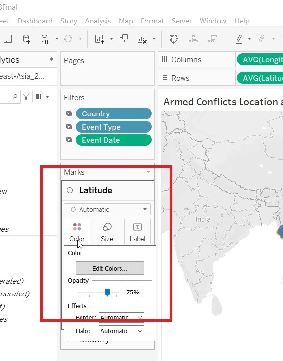
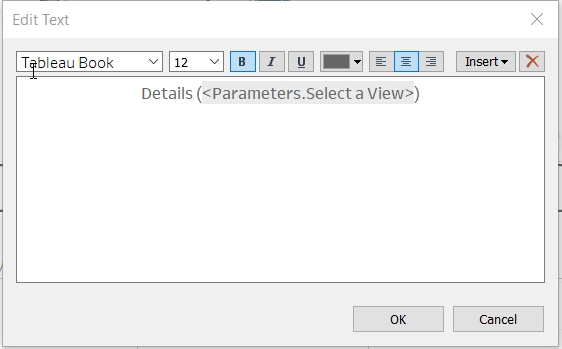

```{r setup, include=FALSE}
knitr::opts_chunk$set(echo = FALSE)
```

# Data Visualisation Critique

The original visualisation (as follows) reveal the spatio-temporal patterns of armed conflict in selected South-East Asia countries between 2015 to 2020. 
 <br><br> 

## Clarity

| **S/N**	| **CRITIQUES**                                                                                                            	| **SUGGESTIONS**                                              	|
|-----	|----------------------------------------------------------------------------------------------------------------------	|----------------------------------------------------------	|
| 1.   	| Under the "Armed Conflict Event by Type" chart, the Y-axis for each of the event type did not start from 0 and had different interval values. This will mislead the reader in thinking that the line chart are of the same value scale. | To standardise the Y-axis interval.         	|
| 2.   	| Under the "Armed Conflict Event by Type" chart, the title of the Y-axis ("Count of Sheet1") is not intuitive. Unsure what the Y-value actually meant. | To change the title of the Y-axis.           	|
| 3.   	| The title for the left chart stated that the map shows information on Myanmar. However, the title for the right chart did not confirm that the information showed in the right charts are for Myanmar. | To label the title clearly.           	|
| 4.    | The colored circles on the map show the location of individual events. As multiple events could happened on the same location, the overlapping information might not be picked up by the readers. Will be good to show summation of number of events that occur on a particular location. This will allow readers to know the frequency in which a particular events had occurred. | To provide summation of number of events that occurs on a particular location.|

## Aesthetics

| **S/N**	| **CRITIQUES**                                                                                                            	| **SUGGESTIONS**                                              	|
|-----	|----------------------------------------------------------------------------------------------------------------------	|----------------------------------------------------------	|
| 1.   	| The colored circles on the map had covered the labeling for "Myanmar". Will be good to label the country so that readers know that is the map for Myanmar.                           	| To label the countries clearly.   	|
| 2.   	| Under the "Armed Conflict Event by Type" chart, the value after 2019 could not be seen clearly. | To show the value of the X-axis clearly.  |   
| 3.    | The labeling on the "Armed Conflict Event by Type" chart should use darker color tone to make it more prominent. | To use darker color tone for label.      |
| 4.    | No X-axis gridline for the "Armed Conflict Event by Type" chart. Hard to interpret the value for the x-axis (Year).       | To include gridline for X-axis.    |


## Interactivity

| **S/N**	| **CRITIQUES**                                                                                                            	| **SUGGESTIONS**                                              	|
|-----	|----------------------------------------------------------------------------------------------------------------------	|----------------------------------------------------------	|
| 1.   	| Currently, readers are only able to filter by country. Should also allow readers to filter by event types so that he can focus on the information that he wanted.  |To allow readers to select and focus on the event of his choice as well. 	|
| 2.    | The tooltip show the Event ID Cnty, Longitude, Latitude and Event Type.  The information presented is not useful to readers.Could provide more statistical information to the readers. | To provide more statistical information in the tooltips. | 


# Proposed Design


The Advantages or issues that the alternative design tries to overcome are:

- Tooltip to include more statistical information of the country.<br><br>
- To provide overview of the type of events (Demonstrations (includes Protests and Riots), Non-violent Actions (includes Strategic Developments) and Violent Events (includes Battles, Explosions/Remote Violence and Violence against Civilians)) instead of the detailed breakdown of the different type of events (Battles, Explosions/Remote Violence, Protests, Riots, Strategic Developments and Violence against civilian). This will allow readers to have a quick overview of the information. The detailed breakdown will be included in the tooltips. Those interested can see more details under the tooltips. <br><br>
- Use Choropleth Map to represent the number of events that each countries have. This will give readers a quick overview on the number of events that happened in South East Asia. Readers who want to know more details can read more information in the tooltip.<br><br>
- Beside country, to also allow readers to filter information by event type. This allow user to focus on the type of event he wanted. <br><br>
- Beside the number of events, to include information on the number of fatalities as well. <br><br>


# Data Visualisation Steps

- <b>Import data into Tableau / Data Cleaning</b> <br><br> 
1. Select "Microsoft Excel" from Connect Panel.<br><br> <br><br> 
2. Select "Southeast-Asia_2010-2020_Oct31.xlxs". <br><br> <br><br>  
3. Click on Add filter to choose data from 2015 to 2020 only. <br><br> <br> 
4. Add filter to "Event Date". <br><br>  <br><br> 
5. Select only 2015 to 2020 under Years <br><br>  <br><br>
6. Hide all the parameters except "Event Id Cnty", "Event Date", "Event Type", "Country", "Latitude", "longtitude","Year", "Location" and "Fatalities".<br><br> {width=100%} <br><br> 
{width=100%} <br><br> 
7. Create a new calculated field "Event_Overview" to aggregate the event_type into three groups. <br><br>  <br><br>
8. On the connection, click on Extract. <br><br>  <br><br>


- <b>Create Visualisation for EventType</b> <br><br> 
1. Put "Event Date to Column, Event Type to Rows, Event Id Cnty to Rows. <br><br> {width=100%}  <br><br> 
2. Change the Measure for Event Id Cnty to Count. <br><br> {width=100%}  <br><br>
3. Change the CNT(Event Id Cnty) to Bar under Marks card. <br><br>   <br><br>
4. Put Fatalities to Rows. <br><br> {width=100%}  <br><br>
5. Change the Fatalities to Line under Marks card. <br><br>   <br><br>
6. Convert SUM(Fatalities) into Dual Axis. <br><br> {width=100%}  <br><br>
7. Synchronise the axes. <br><br> {width=100%}  <br><br>
8. Unhide the Show Header <br><br> {width=100%}  <br><br>
9. Edit the axis to change the title of the Y-axis to Total. <br><br> {width=100%} 
<br><br>  <br><br>
10. Bring the Mark to front. <br><br> {width=100%}  <br><br>
11. Change the Color of the Bar and Line by clicking on Color and edit color. <br><br>   <br><br> {width=100%}  <br><br>
12. Put Year to Detail under CNT(Event Id Cnty) Marks card and Rename the Title of the Chart. 
<br><br> <br><br> {width=100%}  <br><br>
13. Create a Parameter "Select a View". Right click on any empty pane, select Create Parameter.<br><br>   <br><br>   <br><br>
14. Create a Calculated Field "Display Sheet". <br><br>   <br><br>
15. Add Display Sheet to Filter. <br><br>   <br><br>
16. Select Custom Value List and put in Overview. <br><br>   <br><br>
17. Save the sheet as EventType.<br><br>

- <b>Create Visualisation for EventOverview</b> <br><br> 
1. Duplicate the EventType sheet. <br><br>   <br><br>
2. Rename the sheet as EventOverview. <br><br>
3. Replace EventType in Rows with Event_Overview.  <br><br> {width=100%}  <br><br>
4. Rename the Measure Name. <br><br> {width=100%}  <br><br>
5. Change the Alias. <br><br> {width=100%}  <br><br><br><br>
6. Put Country to Filter. <br><br>   <br><br>
7. Click on Show Filter. <br><br> {width=100%}  <br><br>
8. For the Country Filter to be applied to other sheets. Choose Selected Worksheets. <br><br>  <br><br>
9. Allow the filter to be applied to all sheets. Click on Apply to Worksheets. <br><br> {width=100%}  <br><br>
10. Put Event Date to Filter and choose Range of Date (1 Jan 2015 to 31 Dec 2020). <br><br> {width=100%}  <br><br>{width=100%}  <br><br>
11. Apply the filter to all the sheets.<br><br>  <br><br>
12. Add in a reference line by right clicking on the pane. <br><br>  <br><br>

- <b>Create Visualisation for ToolTip1</b> <br><br> 
1. Put Country to Columns, Event_Overview to Rows and Event Id Cnty to Text (changing measures to Cnt).<br><br>{width=100%}  <br><br> 
2. Save the sheet as ToolTip1. <br><br>

- <b>Create Visualisation for ToolTip2</b> <br><br> 
1. Duplicate ToolTip1. <br><br><br><br> 
2. Replace Event_Overview with Event Type. <br><br><br><br> 
2. Save the sheet as ToolTip2. <br><br>


- <b>Create Visualisation for Percentage Chart</b> <br><br> 
1. Put Country to Columns, Event Id Cnty to Rows (changing measures to Cnt) and Event Overview to Color.<br><br>{width=100%}  <br><br> 
2. Go to Quick Table Calculation under CNT(Event Id Cnty) and change to Percent of Total. <br><br>{width=100%}  <br><br>
3. Change the Compute Using to Table(Down). <br><br>{width=100%}  <br><br>
4. Save the sheet as Percentage Chart. <br><br>


- <b>Create Visualisation for Percentage Chart2</b> <br><br> 
1. Duplicate Percentage Chart. <br><br>{width=100%} <br><br> 
2. Replace Event_Overview with Event Type. <br><br><br><br> 
2. Save the sheet as Percentage Chart2. <br><br>


- <b>Create Visualisation for ByCountry</b> <br><br> 
1. Put Country and Event Date to Columns, Event Id Cnty (Change measure to Cnt) to Rows and Event Type to Color. <br><br> {width=100%}  <br><br> 
2. Change to Line, under Marks Card. <br><br> {width=100%}  <br><br>
3. Change the Axis title to Total by double clicking on it. <br><br>   <br><br>
4. Put Display Sheet to Filter. Select Custom Value List and put in By Country <br><br>   <br><br> 
5. Save the sheet as ByCountry. <br><br>

- <b>Create Visualisation for ByEvent</b> <br><br> 
1. Duplicate ByCountry. <br><br> {width=100%}  <br><br>
2. Replace Country with Event Type. <br><br>   <br><br>
3. Put Display Sheet to Filter. Select Custom Value List and put in By Event <br><br>   <br><br> 
4. Save the sheet as ByEvent. <br><br>


- <b>Create Visualisation for DetailedMap</b> <br><br> 
1. Put Longitude to Columns and Latitude to Rows. <br><br> {width=100%}  <br><br>
2. Put EventType to Color, location to Detail and Event Id Cnty to Size <br><br>{width=100%}  <br><br>
3. Change the Event Id Cnty Measures to Count.  <br><br>{width=100%}  <br><br>
4. Change the Color Opacity to 75%. <br><br>{width=100%}  <br><br>
5. Right click on Country to create a new layer. <br><br>{width=100%}  <br><br>
6. Put Country to Color and Year to Detail, under the Country Marks Card. Change to Map <br><br> <br><br>
7. Change the Opacity to 5% and Color of the Countries. <br><br>{width=100%}  <br><br>
8. Edit the Tooltips. <br><br>{width=100%}  <br><br>
9. Change the title of the sheet. <br><br> {width=100%}  <br><br>
10. Allow user to filter by Event Type. Drag Event Type to Filter.   <br><br>
11. Show Filter and change it to Single Value (list). Change the title. {width=100%}  <br><br>
12. Allow the filter to be applied to all sheets. Click on Apply to Worksheets. <br><br> {width=100%}  <br><br>
13. Choose Selected Worksheets. <br><br>  <br><br>
14. Change the tooltips. <br><br>{width=100%} <br><br>
15. Save the sheet as DetailedMap<br><br>

- <b>Create Visualisation for MapOverview</b> <br><br> 
1. Put Longitude(generated) to Columns and Latitude(generated) to Rows. <br><br> {width=100%}  <br><br>
2. Put Event Id Cnty to Color and choose Add all members <br><br>{width=100%}  <br><br>
3. Change Measure to Count <br><br> {width=100%}  <br><br>
4. Put Country to Label, Country to Detail, Fatalities to Detail<br><br> <br><br>
5. Hold on the Cntrl key and drag Latitude(generated). <br><br>{width=100%}  <br><br>
6. On the second Latitude(generated) Mark card, put Event_Overview to Color and Country to Detail. 
<br><br> <br><br>
7. Put Event Id Cnty to Size and change the Measure to Count.<br><br>{width=100%} <br><br>
8. Change the Size. <br><br>{width=100%} <br><br>
9. On the Latitude(generated), click on Dual Axis. <br><br>{width=100%} <br><br>
10. Change the title of the sheet. <br><br>{width=100%} <br><br>
11. Change the title for CNT(Event Id Cnty).  <br><br>{width=100%} <br><br>
12. Change the color of the Number of Conflicts. <br><br> <br><br>
13. Rename the title for Event_Overview.<br><br>{width=100%} <br><br>
14. Change the tooltips. <br><br>{width=100%} <br><br>
15. Save the sheet as MapOverview. <br><br>


- <b>Create Dashboard - MainDash</b> <br><br> 
1. Drag MapOverview and EventOverview to the Dashboard. <br><br>{width=100%} <br><br>
2. Resize and rearrange the "Menu Bar". Add in a Navigation Button by selecting it under Object. <br><br><br><br> <br><br>
3. Rename the dashboard as MainDash.<br><br>

- <b>Create Dashboard - DetailedDash</b> <br><br> 
1. Drag DetailedMap and EventType to the Dashboard. <br><br>{width=100%} <br><br>
2. Change the Object to Floating. <br><br> <br><br>
3. Drag a Vertical object to the dashboard and align it to EventType Pane. <br><br>{width=100%} <br><br>
4. Hold down shift key and drag ByCountry to the "Floating Pane". <br><br>{width=100%} <br><br>
5. Repeat steps 3 and 4 for ByEvent.
6. Add a Text object to the center of the dashboard. <br><br>{width=100%} <br><br>{width=100%} <br><br>
7. Add the parameter to the "Legend Bar", so as to allow the selection of different views. Click on the triangle at the Container. <br><br>{width=100%} <br><br>{width=100%} <br><br>
7. Resize and rearrange the "Legend Bar". Add in a Navigation Buttons <br><br> <br><br>
8. Rename the dashboard as DetailedDash.<br><br>


# Final Data Visualisation Output

{width=100%}<br><br>{width=100%} <br><br>  

## Changes from Original Design

- To have a total of two dashboards instead of one. The first dashboard give readers a quick overview of 
1) the number of fatalities from 2015 to 2020.
2) Pie chart on the map to detailed out the proportion of events/conflicts (Demonstrations, Non-violent Actions and Violent Events).
3) An overview of the number of events/conflicts that each countries have using Choropleth Map.
4) Tooltips to show breakdown of the total of event and percentage of total.

Readers who are interested in more details, able to navigate to the next dashboard for more information.

- The second dashboard provide readers with:
1) Detailed location of each of the event/conflict.
2) Chart to show the number of fatalities and conflicts, breakdown by event type (Battles, Explosions/Remote Violence, Protests, Riots, Strategic Developments and Violence against civilian).
3) Allow readers to filter by country or by event, so as to focus on the relevant information.
4) Tooltips to show breakdown of the total of event and percentage of total.
5) Allow readers to change the view of the chart (by Country or by Event)


## Observation 1

Based on the Choropleth Map, it shows that Philippines had the most number of conflicts between 2015 to 2020. Focusing on Philippines, it can be observed that the number of fatalities due to violent conflicts gradually decreases from 2016. 
<br><br>{width=100%} <br> {width=100%} <br>  {width=100%} <br> 


## Observation 2

Based on the pie chart on the map, it can be observed that the capital of the countries experienced the most number of protests.
<br><br>{width=100%} <br> 


## Observation 3

Most of the Battles in Myanmar, occurred in Rakhine and Shan state. In Thailand, most of the battles happened at the southern states (Narathiwat, Yala and Pattani). In Philippines, battles happened across the country. 
<br><br>{width=100%} <br> 

## Observation 4

Battles and Violence against Civilians resulted in most number of fatalities. 
<br><br>{width=100%} <br> 


## Observation 5

Kalimantan (Indonesia) is relatively peaceful, without much conflicts from 2015 to 2020. Most of the conflicts happened at the borders of Kalimantan.It can also be observed that there is a spikes in the number of Protests in Indonesia and Thailand in 2020.
<br><br>{width=100%} <br> {width=100%} <br> 
