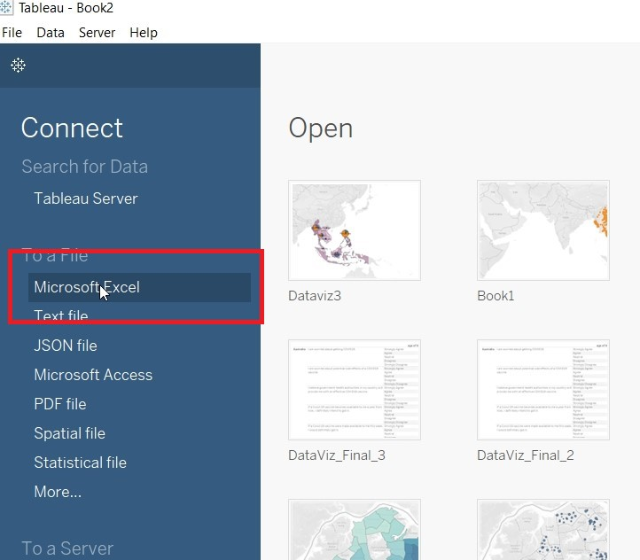
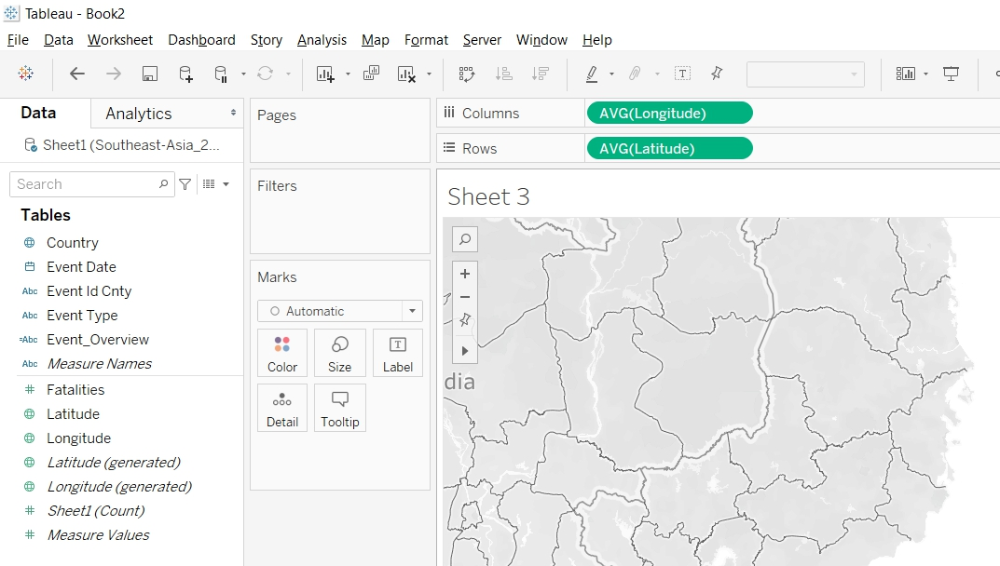

```{r setup, include=FALSE}
knitr::opts_chunk$set(echo = FALSE)
```

# Data Visualisation Critique

The original visualisation (as follows) reveal the spatio-temporal patterns of armed conflict in selected South-East Asia countries between 2015 to 2020. 
 <br><br> 

## Clarity

| **S/N**	| **CRITIQUES**                                                                                                            	| **SUGGESTIONS**                                              	|
|-----	|----------------------------------------------------------------------------------------------------------------------	|----------------------------------------------------------	|
| 1.   	| Under the "Armed Conflict Event by Type" chart, the Y-axis for each of the event type did not start from 0 and had different interval values. This will mislead the reader in thinking that the line chart are of the same value scale. | To standardise the Y-axis interval.         	|
| 2.   	| Under the "Armed Conflict Event by Type" chart, the title of the Y-axis ("Count of Sheet1") is not intuitive. Unsure what the Y-value actually meant. | To change the title of the Y-axis.           	|
| 3.   	| The title for the left chart stated that the map shows information on Myanmar. However, the title for the right chart did not confirm that the information showed in the right charts are for Myanmar. | To label the title clearly.           	|

## Aesthetics

| **S/N**	| **CRITIQUES**                                                                                                            	| **SUGGESTIONS**                                              	|
|-----	|----------------------------------------------------------------------------------------------------------------------	|----------------------------------------------------------	|
| 1.   	| The colored circles on the map had covered the labeling for "Myanmar". Will be good to label the country so that readers know that is the map for Myanmar.                           	| To label the countries clearly.   	|
| 2.   	| Under the "Armed Conflict Event by Type" chart, the value after 2019 could not be seen clearly. | To show the value of the X-axis clearly.  |   
| 3.    | The labeling on the right chart should use darker color tone to make it more prominent. | To use darker color tone for label.      |


## Interactivity

| **S/N**	| **CRITIQUES**                                                                                                            	| **SUGGESTIONS**                                              	|
|-----	|----------------------------------------------------------------------------------------------------------------------	|----------------------------------------------------------	|
| 1.   	| Currently, readers are only able to select and focus on the country of his choice. No further information are presented. | To have tooltips to provide more information to the readers, like number of conflicts etc.   	|
| 2.   	| Readers are unable to select and focus on the events of his choice.  | To allow readers to select and focus on the event of his choice.     	


# Proposed Design


The Advantages or issues that the alternative design tries to overcome are:

- To include tooltips to detail out more information. <br><br>
- To provide overview of the type of events (Demonstrations, Non-violent Actions and Violent Events) instead of the detailed breakdown of the different type of events (Battles, Explosions/Remote Violence, Protests, Riots, Strategic Developments and Violence against civilian). This will allow readers to have a quick overview of the information. The detailed breakdown will be included in the tooltips. Those interested can see more details under the tooltips. <br><br>
- Use Choropleth Map to represent the number of events that each countries have. This will give readers a quick overview on the number of events that happened in South East Asia. Readers who want to know more details can read more information in the tooltip.<br><br>
- Beside country, to also allow readers to filter information by event type. This allow user to focus on the type of event he wanted. <br><br>
- Beside the number of events, to include information on the number of fatalities as well. <br><br>


# Data Visualisation Steps

- <b>Import data into Tableau / Data Cleaning</b> <br><br> 
1. Select "Microsoft Excel" from Connect Panel.<br><br> <br><br> 
2. Select "Southeast-Asia_2010-2020_Oct31.xlxs". <br><br> <br><br>  
3. Click on Add filter <br><br> <br> 
4. Add filter to "Event Date". <br><br>  <br><br> 
5. Select only 2015 to 2020 under Years <br><br>  <br><br>
6. Hide all the parameters except "Event Id Cnty", "Event Date", "Event Type", "Country", "Latitude", "longtitude" and "Fatalities".<br><br> {width=100%} <br><br> 
{width=100%} <br><br> 
7. Create a new calculated field "Event_Overview". <br><br>  <br><br>
8. Final data parameters as follows. <br><br> {width=100%}  <br><br>


- <b>Create Visualisation for EventType</b> <br><br> 
1. Put "Event Date to Column, Event Type to Rows, Event Id Cnty to Rows. <br><br> {width=100%}  <br><br> 
2. Change the Measure for Event Id Cnty to Count. <br><br> {width=100%}  <br><br>
3. Put Fatalities to Rows. <br><br> {width=100%}  <br><br>
4. Change the Fatalities to Bar under Marks card. <br><br> {width=100%}  <br><br>
5. Change the Color of the Bar. <br><br> {width=100%}  <br><br>
6. Convert SUM(Fatalities) into Dual Axis. <br><br> {width=100%}  <br><br>
7. Synchronise the axes. <br><br> {width=100%}  <br><br>
8. Unhide the Show Header <br><br> {width=100%}  <br><br>
9. Edit the axis to change the title of the Y-axis to Total. <br><br> {width=100%}  <br><br>  <br><br>
10. Bring the Mark to front. <br><br> {width=100%}  <br><br>
11. Save the sheet as EventType.<br><br>

- <b>Create Visualisation for EventOverview</b> <br><br> 
1. Duplicate the EventType sheet. <br><br>   <br><br>
2. Rename the sheet as EventOverview. <br><br>
3. Replace EventType in Rows with Event_Overview.  <br><br> {width=100%}  <br><br>
4. Rename the Measure Name. <br><br> {width=100%}  <br><br>
5. Change the Alias. <br><br> {width=100%}  <br><br>{width=100%}  <br><br>
6. Put Country to Filter. <br><br>   <br><br>
7. Click on Show Filter. <br><br> {width=100%}  <br><br>
8. Change to Single Value(List). <br><br> {width=100%}  <br><br>
9. Allow the filter to be applied to all sheets. Click on Apply to Worksheets. <br><br> {width=100%}  <br><br>
10. Choose Selected Worksheets. <br><br>  <br><br>


- <b>Create Visualisation for DetailedMap</b> <br><br> 
1. Put Longitude to Columns and Latitude to Rows. <br><br> {width=100%}  <br><br>
2. Put EventType to Color and Event Id Cnty to Detail <br><br>{width=100%}  <br><br>
3. Change the title of the sheet. <br><br> {width=100%}  <br><br>
4. Allow user to filter by Event Type. Drag Event Type to Filter.   <br><br>
5. Show Filter and change it to Single Value (list). Change the title. {width=100%}  <br><br>
6. Allow the filter to be applied to all sheets. Click on Apply to Worksheets. <br><br> {width=100%}  <br><br>
7. Choose Selected Worksheets. <br><br>  <br><br>
8. Save the sheet as DetailedMap<br><br>

- <b>Create Visualisation for MapOverview</b> <br><br> 
1. Put Longitude(generated) to Columns and Latitude(generated) to Rows. <br><br> {width=100%}  <br><br>
2. Put Event Id Cnty to Color and choose Add all members <br><br>{width=100%}  <br><br>
3. Change Measure to Count <br><br> {width=100%}  <br><br>
4. Put Country to Label, Country to Detail, Fatalities to Detail<br><br> <br><br>
5. Hold on the Cntrl key and drag Latitude(generated). <br><br>{width=100%}  <br><br>
6. On the second Latitude(generated) Mark card, put Event_Overview to Color and Country to Detail. 
<br><br> <br><br>
7. Put Event Id Cnty to Size and change the Measure to Count.<br><br>{width=100%} <br><br>
8. Change the Size. <br><br>{width=100%} <br><br>
9. On the Latitude(generated), click on Dual Axis. <br><br>{width=100%} <br><br>
10. Change the title of the sheet. <br><br>{width=100%} <br><br>
11. Change the title for CNT(Event Id Cnty).  <br><br>{width=100%} <br><br>
12. Change the color of the Number of Conflicts. <br><br> <br><br>
13. Rename the title for Event_Overview.<br><br>{width=100%} <br><br>
14. Change the tooltips. <br><br>{width=100%} <br><br>
15. Save the sheet as MapOverview. <br><br>


- <b>Create Visualisation for Mapbytime</b> <br><br> 
1. Duplicate DetailedMap. Rename the sheet to Mapbytime.<br><br>
2. Drag Event Date to Page. <br><br> <br><br>
3. Customise the Year(Event date). <br><br><br><br>

- <b>Create Visualisation for Eventbytime</b> <br><br> 
1. Duplicate EventType Rename the sheet to Eventbytime<br><br>
2. Drag Event Date to Page. <br><br> <br><br>
3. Customise the Year(Event date). <br><br>{width=100%} <br><br>


- <b>Create Dashboard - MainDash</b> <br><br> 
1. Drag MapOverview and EventOverview to the Dashboard. <br><br>{width=100%} <br><br>
2. Edit the title for MapOverview. <br><br>{width=100%} <br><br>
3. Edit the title for EventOverview.  <br><br>{width=100%} <br><br>
4. Resize and rearrange the "Legend Bar". Add in a Navigation Button <br><br>{width=100%} <br><br>
5. Rename the dashboard as MainDash.

- <b>Create Dashboard - DetailedDash</b> <br><br> 
1. Drag DetailedMap and EventType to the Dashboard. <br><br>{width=100%} <br><br>
2. Edit the title for EventType  <br><br>{width=100%} <br><br>
3. Resize and rearrange the "Legend Bar". Add in a Navigation Buttons <br><br> <br><br>
4. Rename the dashboard as DetailedDash.

- <b>Create Dashboard - Dashbytime</b> <br><br> 
1. Drag Mapbytime and Eventbytime to the Dashboard. <br><br>{width=100%} <br><br>
2. Resize and rearrange the "Legend Bar". Add in a Navigation Button <br><br> <br><br>
3. Rename the dashboard as Dashbytime.


- <b>Create Navigation</b> <br><br> 
1. On MainDash, double click on Navigation to launch the popup menu.<br><br>{width=100%} <br><br>
2. Change the setting for the popup menu. <br><br> <br><br>
3. On DetailedDash, double click on the top Navigation button to launch the popup menu. <br><br>{width=100%} <br><br>
4. Change the setting for the popup menu. <br><br> <br><br>
5. On DetailedDash, double click on the lower Navigation button to launch the popup menu. <br><br>{width=100%} <br><br>
6. Change the setting for the popup menu. <br><br> <br><br>
7. On Dashbytime, double click on Navigation to launch the popup menu.<br><br>{width=100%} <br><br>
8. Change the setting for the popup menu. <br><br><br><br> 
9. Final navigation flow as follows. <br><br>{width=100%} <br><br> 


# Final Data Visualisation Output

{width=100%}<br><br>{width=100%} <br><br>  {width=100%} <br><br> 

## Changes from Original Design

- To have a total of three dashboards instead of one. The first dashboard give readers a quick overview of 
1) the number of fatalities from 2015 to 2020.
2) Pie chart on the map to detailed out the proportion of events/conflicts (Demonstrations, Non-violent Actions and Violent Events).
3) An overview of the number of events/conflicts that each countries have using Choropleth Map.

Readers who are interested in more details, able to navigate to the next dashboard for more information.

- The second dashboard provide readers with:
1) Detailed location of each of the event/conflict.
2) Chart to show the number of fatalities and conflicts between 2015 to 2020, breakdown by event type (Battles, Explosions/Remote Violence, Protests, Riots, Strategic Developments and Violence against civilian).
3) Allow readers to filter by country or by event, so as to focus on the relevant information.

Readers who are interested to see the breakdown by time, able to navigate to the third dashboard.

- The third dashboard allows the readers to filter the events and country by time.


## Observation 1

Philippines had the most number of conflicts between 2016 to 2020 and also had the most number of fatalities across South East Asia. However, it can be observed that the number of violent conflicts gradually decreases from 2016. 
<br><br>{width=100%} <br> 

## Observation 2

Most of the Battles, Explosion/Remote Violence, Strategic Developments and Violent against Civilians that happen in Myanmar, occurred in Rakhine and Shan state. 
<br><br>{width=100%} <br> 

## Observation 3

Battles and Violence against Civilians resulted in most number of fatalities. 
<br><br>{width=100%} <br> 


## Observation 4

Indonesia had seen a sharp increase in number of Protests from 2017 to 2020. 198 events recorded in 2017 and 1050 events recorded in 2020.
<br><br>{width=100%} <br> 

## Observation 5

Kalimantan (Indonesia) is relatively peaceful, without much conflicts from 2015 to 2020. Most of the conflicts happened at the borders of Kalimantan.
<br><br>{width=100%} <br> 
